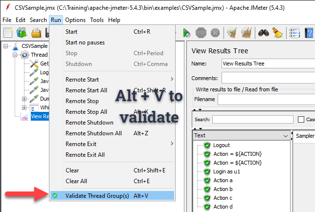

# 🚀 Validate Thread Group button

Add a `Validate Thread Group(s)` button to the JMeter toolbar.

# 🌟 Why do we need this?

Often when we debug our JMeter test plan, we configure the thread group to one iteration and one thread. We click on Run
button (or shortcut) to execute the test plan.

But the test plan in the repository or CI/CD pipeline might have different values (or default values) which you do not 
want to change. `Validate` option helps us to run the test with one thread, one iteration with no timers.

Right-clicking on the thread group and keep validating is cumbersome.

This plugin simply adds `Validate` button feature to the toolbar, so that we don't need to right-click everytime. 

⚡ Productivity improvement is negligible. *Something is better than nothing.* 

# 🤔 How to?

* Building using maven `mvn clean package`
* Copy the generated jar to `JMETER_HOME\lib\ext`
* Restart JMeter
* The new "Validate Thread Group(s)" icon will be displayed on the toolbar.

  

* It will also add a menu as shown below which you do not want to use.

  

# ✅ Features

* Validates all your test plan at once (when no Thread Group is selected in the test plan)
* Validates a specific Thread group (when selected on the test plan.)
  - Click on "Thread Group" under the test plan and click "Validate Thread Group(s)" icon on the toolbar.
 